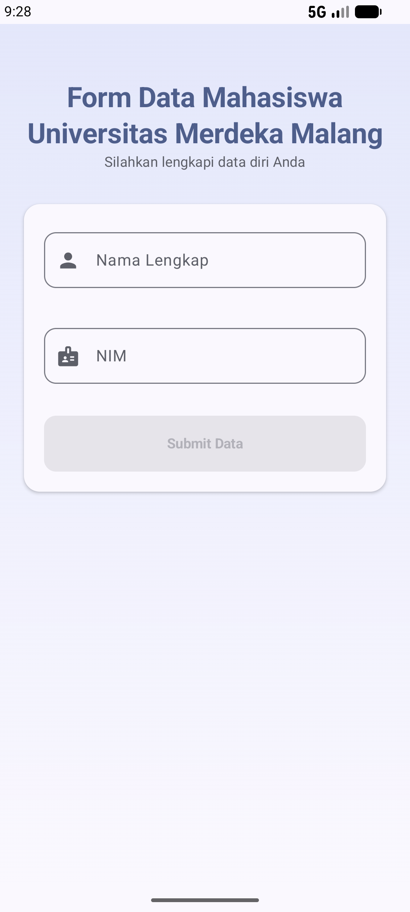
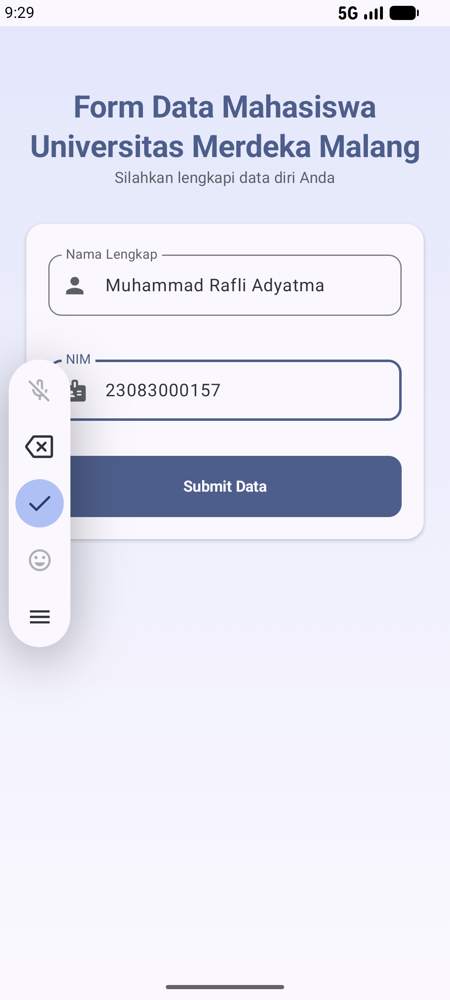
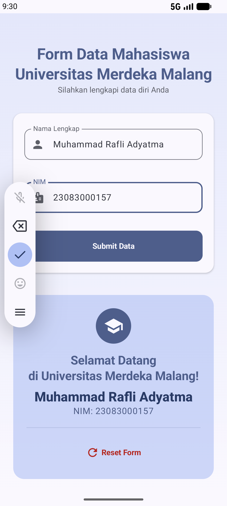

# 📱 Project Week 1: Hello World ✨

> **Aplikasi Form Input Data Mahasiswa** berbasis Android modern yang dibangun menggunakan **Jetpack Compose** dan **Material Design 3** 🚀

---

## 👤 Informasi Mahasiswa

| 📌 Detail | 📝 Keterangan |
|---|---|
| 👨‍🎓 **Nama** | **Muhammad Rafli Adyatma** |
| 🆔 **NIM** | **23083000157** |
| 🏫 **Kampus** | **Universitas Merdeka Malang** |
| 📚 **Mata Kuliah** | **Pemrograman Mobile** |

---

## 🌟 Fitur Utama

- 📝 **Input Form Interaktif:** Form pengisian Nama Lengkap dan NIM.
- ⚡ **Validasi Real-Time:** Tombol submit otomatis aktif jika input NIM (8-15 angka) dan Nama sudah valid.
- 🎨 **Desain Modern (Material 3):** Tampilan responsif, bersih, dan konsisten.
- 🔄 **Reset State:** Fitur untuk mengosongkan kembali form data secara instan.

---

## 📸 Snapshots Aplikasi

Berikut adalah tampilan dari setiap alur layar pada aplikasi:

### 1. 📝 Tampilan Form Kosong

> **Keterangan:**
> Tampilan awal saat aplikasi pertama kali dibuka:
> - 👤 **Nama Lengkap:** Menggunakan `OutlinedTextField` dengan ikon pengguna.
> - 🪪 **NIM:** Menggunakan `OutlinedTextField` khusus angka (*numeric keyboard*).
> - 🚫 **Tombol Submit:** Non-aktif (*disabled*) hingga seluruh data terisi dengan benar.

---

### 2. ✏️ Pengisian Data & Validasi

> **Keterangan:**
> Tahap pengisian form dan pemeriksaan validasi:
> - 🔍 **Validasi Real-Time:** NIM harus berupa angka dengan rentang panjang **8 hingga 15 karakter**.
> - 🟢 **Status Aktif:** Setelah data valid, tombol **Submit Data** berubah menjadi aktif dan siap diklik.

---

### 3. 🎉 Hasil Submit (Success State)

> **Keterangan:**
> Tampilan respon setelah tombol submit ditekan:
> - 🎴 **Result Card:** Kartu hasil serasi yang menampilkan pesan konfirmasi & detail mahasiswa.
> - 💬 **Pesan Personal:** Menyapa mahasiswa sesuai nama & NIM yang dimasukkan.
> - 🔄 **Tombol Reset Form:** Menghapus input dan mengembalikan layar ke state awal.

---

## 🛠️ Teknologi yang Digunakan

- 🔤 **Kotlin** — Bahasa pemrograman utama untuk pengembangan Android.
- 🧩 **Jetpack Compose** — Toolkit UI deklaratif modern bawaan Google.
- 🎨 **Material Design 3** — Component library & guideline UI/UX terkini.
- ⚡ **State Management** — Pengelolaan UI state reaktif dengan `remember` & `mutableStateOf`.

---
